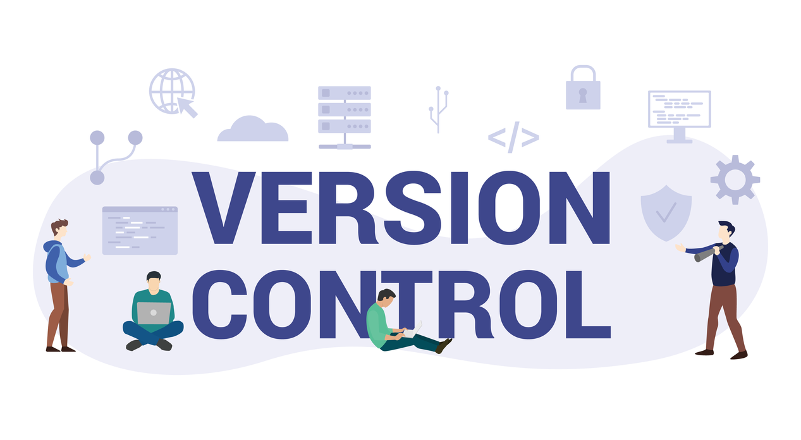

# Getting Started with Source/Version Control



## What is Source Control?

Source control is a way to track changes to your code over time. It is a complete history of all the changes that have been made to your code. Imagine the Git history as a tree. Each commit is a branch in the tree. Each branch is a snapshot of your code at a specific point in time. Branches can also split and diverge from the main branch. These branches can be merged back into the main branch when you are ready.

You can think of it as a time machine for your code. You can go back in time and see what your code looked like at any point in time. Source control allows you to revert back to a previous version of your code if you make a mistake.

Source control allows you to collaborate with others on the same code base. Multiple people can work on the same code base at the same time without overwriting each other's changes. The branch-merge pattern allows you to work on a new feature on a branch of the source tree, without affecting the functionality of the main code base. You can then merge your changes into the main code base when you are ready.

### Why use Source Control?

Source control is a great way to keep track of your code and collaborate with others. It allows you to revert back to a previous version of your code if you make a mistake. It also allows you to collaborate with others on the same code base.

### How to use Source Control?

There are many different ways to use source control. The most common way is to use a tool like Git or SVN. These tools allow you to track changes to your code over time and collaborate with others.

### What is Github?


Github is a web-based hosting service for software development projects that use the Git version control system. It is a place to store your code and collaborate with others. It is also a great place to find open source projects to contribute to.

## The Source Control Workflow

### Clone - Pulling down a copy of the code

The first step in the source control workflow is to clone the code from the remote repository. This will create a local copy of the code on your computer. You can then make changes to the code and commit them back to the remote repository.

```bash
# for example
git clone https://github.com/sanadlab/capstone_project_template.git
```

### Commit - Saving changes to the code

The next step in the source control workflow is to commit your changes to the code. This will save your changes to the local repository. You can then push your changes back to the remote repository.

```bash
# for example
git add . # all files in the current directory
git commit -m "added feature x to do y"
```

### Pull - Getting changes from the remote repository

It is important to pull down the changes from the remote repository before pushing local commits. This will get the changes from the remote repository and merge them into your local repository.

```bash
# for example
git pull
```

### Push - Sending changes to the remote repository

The final step in the source control workflow is to push your changes to the remote repository. This will send your changes to the remote repository. You can then pull down the changes from the remote repository to your local repository.

```bash
# for example
git push
```

### The Dev-Prod Pattern

The dev-prod branch pattern allows a team to work on code development in a separate branch from the main code base. This allows the team to work without breaking the current working code. When the team is ready, they can merge their changes into the main code base.

```bash
# for example
git checkout -b dev # create a new branch called dev

# make changes to the code
###

git add . # all files in the current directory
git commit -m "added feature x to do y"

# merge the main branch into the dev branch before merging to main
git merge main

# fix any merge conflicts
###

# switch to the main branch
git checkout main

# merge the dev branch into the main branch
git merge dev
```

### The Branch-Merge Pattern

The branch-merge pattern is a way for an individual or team to work on a new feature on a separate branch from dev, without affecting the functionality of the main code base or the common dev branch. This allows the team to work on a new feature without breaking the current working code. When the team is ready, they can merge their changes into the dev code base and then into the main code base.

```bash
# for example
git checkout -b feature-x # create a new branch called feature-x

# make changes to the code
###

git add . # all files in the current directory
git commit -m "added feature x to do y"

# merge the dev branch into the feature-x branch before merging to dev
git merge dev

# fix any merge conflicts
###

# switch to the dev branch
git checkout dev

# merge the feature-x branch into the dev branch
git merge feature-x
```

### Branch Merge Diagram

Each node in the diagram represents a commit. The arrows represent the branch-merge pattern.


### What not to commit to Source Control?

- **Do not commit sensitive information like passwords or API keys**
- Try not to commit code that doesn't compile
- Try not to commit code that doesn't work
- Test your code before commiting it
- Do not commit code that does not have comments and documentation of its functionality
- Use meaningful commit messages that describe the changes you made

### Source that should always be present in Control?

- Always maintain at least one README.md file
- Determine an appropriate LICENSE, consider its implications and commit the LICENSE file
